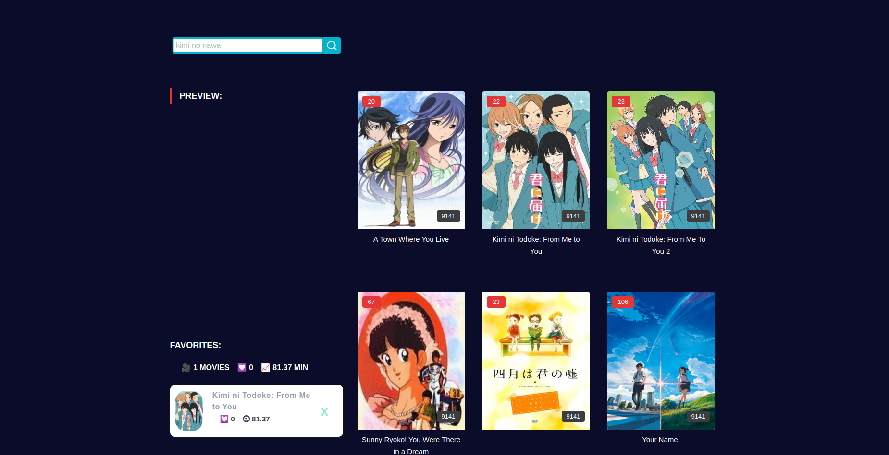

# Anime Streaming Website

Welcome to the Anime Streaming Website, a platform built using ReactJS where anime enthusiasts can explore and enjoy their favorite anime series and movies. This project aims to provide a seamless and engaging experience for anime lovers of all ages. Aside from that, the objective of developing this platform is to fully understanding prop drilling and useEffect hook.

## Technologies Used

## Features

- **Vast Anime Collection:** Explore a vast collection of anime series and movies.

- **Search Functionality:** Quickly find your favorite anime by using the search feature.

- **Mark your favorite anime:** Create and customize user profiles to keep track of your watch history and favorite anime.

- **Responsive Design:** The website is fully responsive, ensuring a great experience on both desktop and mobile devices.

## Screenshots

### Home Page

## Installation

1. Clone the repository to your local machine.
   git clone https://github.com/miggy-pg/ani-hub
2. Navigate to the project directory and install dependencies: `npm install`.
3. Start the development server: `npm start`.
4. Access the website in your browser at `http://localhost:3000`.

## Contributions

Contributions are welcome! If you have any suggestions, improvements, or bug fixes, feel free to submit a pull request.

## Contact

Feel free to reach out to me via email at phillip.mgalan@gmail.com or connect with me on [LinkedIn](https://www.linkedin.com/in/migui-galan/).

Happy streaming!
